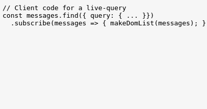

# feathers-live-query

> Live queries with 1 line of JS.



## Getting Started

Getting up and running is as easy as 1, 2, 3.

1. Make sure you have [NodeJS](https://nodejs.org/) and [npm](https://www.npmjs.com/) installed.
2. Install your dependencies
    
    ```
    cd path/to/feathers-live-query
    npm install
    ```

3. Start the server
    
    ```
    npm start
    ```
    
4. Start one or more clients by pointing a browser to `localhost:3030`.

The server runs one cycle of DB commands and then waits on client requests.
The clients communicate with the server using `socket.io` websockets.
They make no requests of the server other than the live request.

You have to restart the server and the clients to rerun the demo.

## Testing

Simply run `npm test` and all your tests in the `test/` directory will be run.

## Help

[The book](http://docs.feathersjs.com).

[The community](https://feathersjs.slack.com/messages/general/).

## Changelog

__0.1.0__

- Initial release

## License

Copyright (c) 2016

Licensed under the [MIT license](LICENSE).
